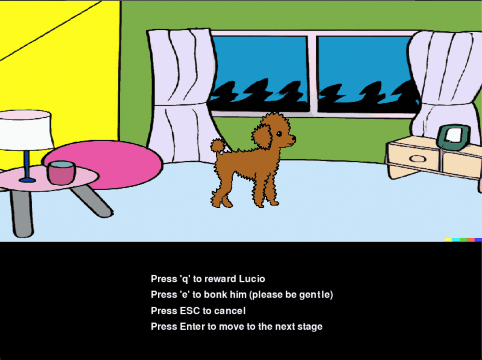
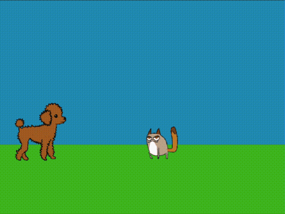

---
title: LucioAI
layout: default
filename: lucioai.md
--- 

## LucioAI
https://github.com/giteliot/lucioai
 

    
    
    
    

 
 
My idea was to try and create a neural network able to learn from live feedback, kind of like a dog would learn commands from a human. 
The simple commands are showed above: **jump**, **crouch**, **sit** and **walk**.

Initally my goal would be to use audio as input, and pass directly the audiowaves enery array to the neural network as input. However I just couldn't manage to make the model learn fast enough, given the variance the array can have, even when representing the same command. 

There are for sure workarounds, like using a pretrained net to transform audio to text, and use the text as the input for my neural net, but it would lose its purpose. I might come back to this problem, as it was really fun, but for now I have up.

I still wanted to reach a conclusion to the project, since I made (thanks DALL-E) the art and I really liked lucio's face! I followed the path of least resistance and used keyboard keys as inputs.

 

    

 

The first scene is the training. It works very intuitively: 

1. the user presses a key

2. the dog/agent/model does an action

3. the users gives a positive or negative feedback

4. back to 1. until the user is satisfied with lucio and continues to testing, by pressing _Enter_.

Is this a user friendly way to do key bindings? *No*. However, is this an easy and straightforward model to implement? *Also no*.

Albeith this might be a skill-issue on my part, but it took me a lot of fine tuning in order to have a model that would train fast enough, without overfitting too much and getting stuck in local minima. 
The main trick was to use a dynamic learning rate: if the user is reinforcing an action that has already been learned (i.e. its probability is already high) then the learning rate will be low, if on the contrary the action is not learned, or is binded to another key, the learning rate will be higher.

The last screen is a simple test of the capabilities of the dog, just as we thought him! What a good boy <3

 

    

 

