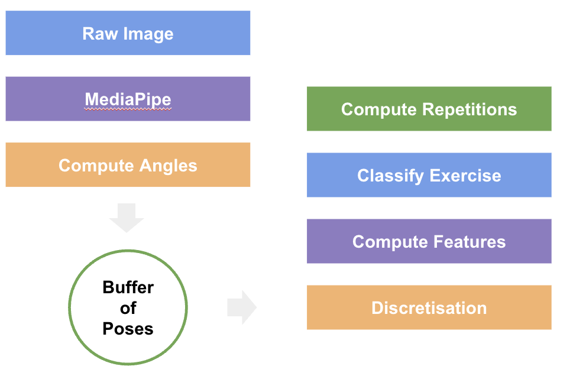

## Personal Trainer AI
My first non-game related side project I am not too disappointed about.  
Sometime last year I got a bit more into weightlifting. I started learning more about different exercises, splits, programs, and so forth. However, I don't like gyms, and I prefer the freedom of working out in my - very minimal - home gym.  

The downside of that is the absence of a personal trainer, or any figure that can give you tips when you are starting out. Hence the idea to create one using artificial intelligence.  
Granted, this is not a particularly new idea, however most of the existing **personal trainer** apps focus more on creating ad hoc plans, while I am more interested in someone looking at my workouts, keeping track of things, and telling me if I am doing something wrong, since I am a beginner.  

This was actually my first idea: to be able to find flaws in lifting technique by comparing it with some reference exercises. However, I decided that for it to make sense I needed simple classification instead, to which I added a repetition count. So that's where we are now. Here is a short video to showcase it. There are only a few reference exercises to choose from for classification, which are learned by passing a single repetition to the application.

  <iframe width="560" height="315" src="https://youtube.com/shorts/LJSc7JFJytE?feature=share" frameborder="0" allowfullscreen></iframe>

### Algorithm
 

    

 

At a super high level, the algorithm works as follows:  
1. Video frames are analyzed with Google [MediaPipe](https://ai.google.dev/edge/mediapipe/solutions/vision/pose_landmarker) pose landmark detection, which detects the joints and returns coordinates in a 2D plane for each of them.  
2. From the coordinates, I compute the angles for each of the 8 main joints: shoulders, elbows, hips, and knees.  
3. The angles, along with a timestamp (a list of 9 floats that I call a *Pose*), are stored in a buffer.  
4. When the buffer is big enough, I take the last N Poses and discretize the angles by taking one angle each T seconds or if there is a jump of at least A degrees. This drastically reduces the amount of data I have to analyze moving forward.  
5. I compute the main features, which are 3: max-min of the angles for each joint, length of the array of angles for each joint, and the number of missing angles for each joint (angles can be missing for a period of time during an exercise, e.g., during a pushup recorded from the front, hips and knees won't be visible).  
6. The features are compared with the features of the reference, which are computed at the application startup and kept in memory, to classify the exercise. If there is no exercise close enough, the classification defaults to "rest".  
7. By analyzing the number of peaks in the angles, we can then compute the number of current repetitions.  

### Use Cases
I think the application has some use as it is, as an easy way to keep track of your exercises, especially on high numbers of reps. However, I would love to put it into an actual mobile app and add some basic functionalities, like a way to easily add new exercises and the history of your workout sessions.  

It would also be cool to have some basic LLM integrations where you can command the app with your voice and have it say informative stuff while you work out, to create a more realistic personal trainer experience.  

Ultimately, instead of having my own exercises as reference, it would be great to create a library from pros, so the app can tell you how to improve your form.  

I am not sure I will bring forward any of this, to be honest. I guess it depends on the response I get.  

Thanks for reading!
