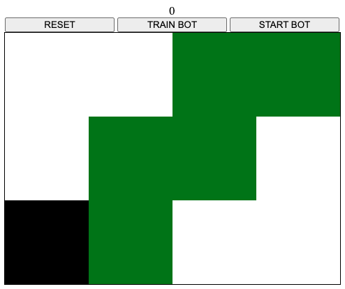
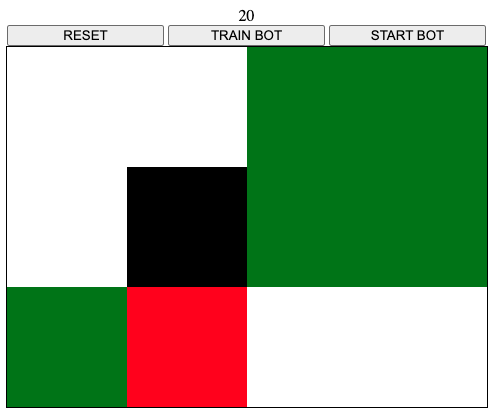
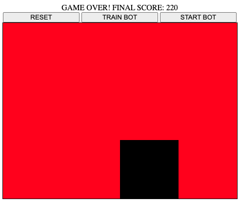
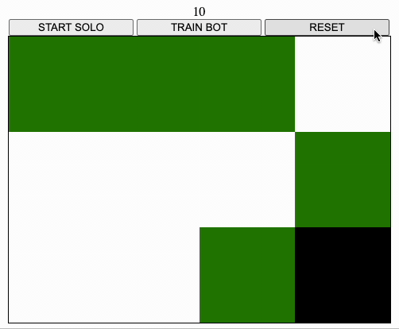

---
title: Untitled
layout: default
filename: qlbrowser.md
--- 

## Untitled
https://github.com/giteliot/ql-browser
 
This untitled puzzle game was a first attempt to do reinforcement learning directly on the browser (no server side resources used!), using Deep Q Learning implemented with tensorflow.js, hence the name **qlbrowser**! 

The agent is absolutely non necessary for the game, you can play without training the agent at all, and the game is simple enough any (most?) humans should be able to get the gist of it pretty quickly and reach perfect play in a few tries, so the agent doesn't reach __superhuman__ abilities, but I guess __human-like__.

Why did you make this then?

Good question! The motivation behind this whole project was to pave the way for another idea, which was to make a rl-based life simulator. The fact that anything would run in the browser would make it very easy (and cheap) to distribute. 
Alas, reality is often disappointing, and the project failed when I realized performance would be terrible, and that other people are already making better implementations of the same idea, although not on the browser (specifically [Bibites](https://www.thebibites.com/)).

That being said, the game is mildly fun in its simplicity, here is how it works.

    
    
    

On the left there is a possible starting screen:

- the black square is the player
- the green square is food
- the white squares are just empty

And here are the rules:
- passing over a green square awards 10 points and turns the square to red
- passing over a red square loses 5 points and ends the game
- passing over a white square loses 5 points
- covering all the table with red squares gains 100 points and ends the game
- there are no borders, e.g. going right when on the right-most sides teleports the user on the left

The maximum score is 220, but it not always obtainable (I think?).

### The Agent

Everything is terribly simple. The action space is just the 4 directions, so Deep Q Leaning is suitable. The code is very inspired by the snake implementation provided in the official repo of tensorflow.js [here](https://github.com/tensorflow/tfjs-examples/tree/master/snake-dqn), where the reward function is exactly the score as described above. 
Once trained, the model is tored in the local storage of the browser, so no need to retrain ever! Here is a little gif of the agent kicking ass.

    

