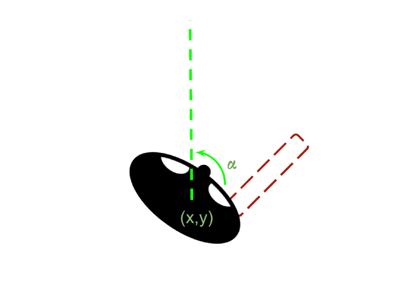
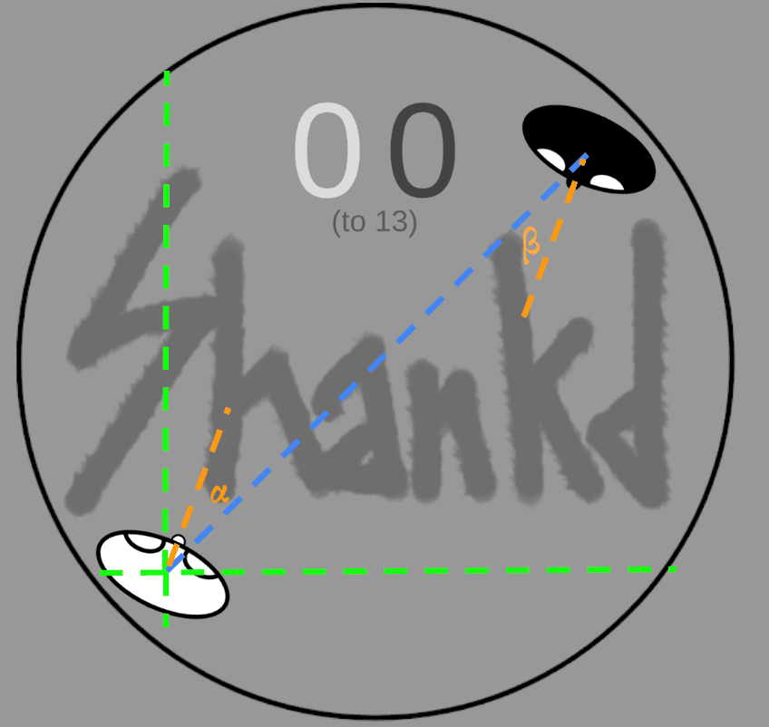

---
title: Shankd
layout: default
filename: shankd.md
--- 

## Shankd

<a href="https://codewithnohands.itch.io/shankd">https://codewithnohands.itch.io/shankd</a>

This is my first game using a proper game engine (Unity) since Game Maker about 20 years ago, which is the excuse I gave myself to let the codebase become such a mess for such a little project. 

The game itself is straightforward, just two characters - black and white - that can move around and have a weapon to stab each other to get points. If they go out of the round playing area, their opponent gets a point instead. First to get N points, depending on the mode and level, wins.

Here is a quick video to get the idea of it.

  <iframe width="560" height="315" src="https://www.youtube.com/embed/FcVoY_CVg2g" frameborder="0" allowfullscreen></iframe>

 
My goal of course was not to create the next big thing in video games, but rather to experiment with PPO and Unity [MLAgents](https://github.com/Unity-Technologies/ml-agents) library. 
However, I had fun playing this with my friends, so I decided to publish it on itch.io.

### The Agent
Having used MLAgents I didn't have to create the neural network from scratch (unfortunately), but I just focused on defining observations and reward function, other than a sprinkle of hyperparameters tuning.

My initial strategy was to define everything as basic and intuitive as possible. 

 

    

 

The **observations** consisted in coordinates for each player, with respect to the plane centered in the center of the ring, the rotation angle with respect to the axis orthogonal to such plane, and four more observations to gather if the hand and/or the weapon are visible, two for each player. 
The **reward function** was exactly the score. If a player gets a point it gets rewarded by 1.0, if their opponent gets a point, they get rewarded -1.0.

In my mind, with enough training this should have been enough for the bot to play perfectly. The reality is that a few hundred thousand steps both the bots would decide to spin around themselves. Apparently the fear of losing overcame the opportunity to increase the reward by trying to score more points. 

After quite a few trials I landed on the following reward function:
- if the player loses on their own (by walking out of the ring): -5.0
- if the player actively wins a point (by stabbing the opponent): +5.0
- -1.0/+1.0 if the player gets stabbed/the opponent walks out of the ring
- -0.02 cumulative if the player is not moving
- a small negative reward inversely proportional to the distance from the opponent

Now, with this new reward function the agent finally started to learn. However, after 100M steps it converged to a version that was still beatable by myself. 

I tried multiple approaches, changing network architecture and reward function, without any improvement whatsoever, and I was quite lost on what to do. PPO was used to have hyperhuman in Chess and Dota, I seriously doubted Shankd was beyond its ability, but I wasn't able to crack it.

As it turns out, I was taking for granted things that are intuitive for humans, but not for machines.

The observations contained all the information that I use when I play in order to make decisions. However, my brain does a lot of processing on those observations, that a neural network is not able to deduce that easily. 

 

    

 

I tried to use derivative observations, that are the ones that I intuitively do when playing the game, which are:
- the distance from the ring border (4 observations)
- the distance from the enemy
- the bearing angle of the player to the opponent, and the one of the opponent towards me
- again the visibility of the hand and weapon

With this new configuration, even with just 500k steps, which takes a few minutes on a MacBook Air M1 with 16Gb RAM, the agent becomes nearly unbeatable. Upping to 10M steps became definitely superhuman.
