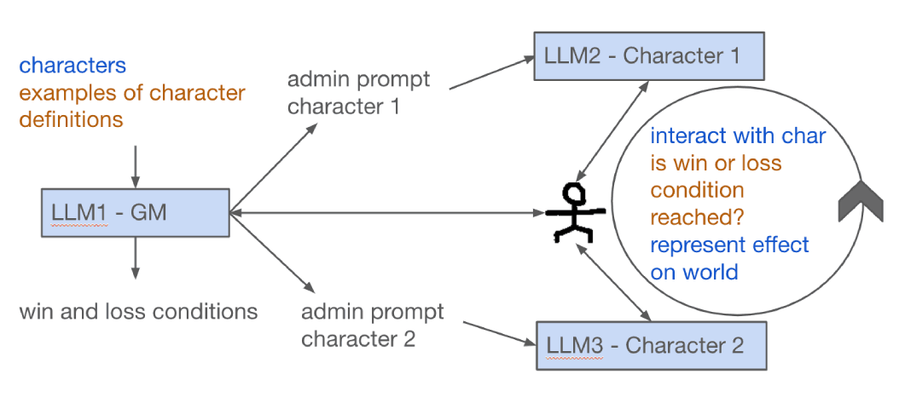

---
title: TinyAdventures
layout: default
filename: tinyadventures.md
--- 

## tinyadventures
<a href="https://github.com/giteliot/tinyadventures">https://github.com/giteliot/tinyadventures</a>

For this one I will spare you the graphics because they are atrocious even by my (very low) standards.

The idea was to try and make a game master for an RPG game using modern LLMs. I have seen many successfull implementation of this idea in pure text games, where _physical_ constraint do not apply, but can it be extended successfully in a videogame? 

Unfortunately the answer is "meh". 

I found extremely hard to make the LLM be constrained to the game implementation, while maintaining a sort of exciting story. Despite providing many examples the stories generated were terribly boring to play, so I decided to not move forward. 

I still learned a lot from this, got my hands on some deeper prompt engineering, and some intuition about the limitations of current state of the art LLMs. 

I will present the general structure of the project and then a few examples, to showcase the pitfalls I encountered.

 

    

 

In my example I fixed the game to three characters, the protagonist (player) the lady (npc) and the dog (npc).
I created 3 LLMs, all instances of GPT4, one for the game master (GM from now on) and one for each NPC (let's call them NPC1 and NPC2).

The first thing we do is to ask GM to come up with a story, this means:
 - a system prompt for NPC1
 - a system prompt for NPC2
 - a list of loss conditions
 - a list of win conditions
 - an opening sentence that introduces the player to the game and invites them to explore their surrounding

 With the first two lines we can instantiate NPC1 and NPC2 and start the game loop.

Each time the player interacts with an NPC, the following things happen:
- we prompt NPCi to return us what the npc did or said
- with NPCi answer we prompt GM to return us 3 options on what are the possibile responses the user can give, each options needs to have associated the impact said action has (e.g. it might trigger the loss or win condition)

The user should keep interacting with the NPCs until a win or loss condition is reached. 
Clearly this is super minimal and can be extended in a number of ways - more NPCs, objects, fighting, etc. - but even this minimal scenario was tough to make it digestable for the LLMs.

## Example 
**GM**
 
Welcome, brave explorer! The whispering woods beckon. Venture forth amidst the emerald canopy and uncover the secrets that lie within the intertwined boughs. Adventure awaits!
  
_Protagonist walks to Lady and starts interaction_
  
**Lady**
 
I am a lost spirit, bound to these woods. Seeking freedom through kindness. Will you help me, kind traveler?

1. Yes, I will help you.

2. Free yourself! I don't have time for the troubles of ghosts. [this would trigger the game loss]

3. You are an abomination to this world, spirit. Be gone! [this would trigger the game loss]

**Protagonist**
 
Yes, I will help you.

**Lady**
 
Thank you, traveler. Show trust, share your stories, and bring a token of pure intent from the heart of the forest.

1. I've faced many perils to be here, trusting no one. Can I truly believe your words, or is this another ploy of the woods? [this would trigger the game loss]

2. Your tale touches my heart, spirit. I will venture into the heart of the forest and retrieve the pure token you speak of. Keep faith, for I shall return.

3. The forest heart hides dangers untold. What if you deceive me? How can I trust you won't vanish or curse me once I give you what you seek? (kill) [this would trigger the game loss]

**Protagonist**
 
Your tale touches my heart, spirit. I will venture into the heart of the forest and retrieve the pure token you speak of. Keep faith, for I shall return.
  
_Protagonist walks to Dog and starts interaction_
  
**Dog**
 
I am the guardian. I protect the secret of these woods. Your intentions, reveal them. Friend or foe?

1. I am a friend to all gentle souls and seek to aid a lost spirit trapped by ancient sorrows. My quest is to retrieve a token of pure intent from the heart of the forest.

2. Move aside, beast! I have no time to parley with the likes of you. Stand down or share the fate of any who cross me! (kill)

3. I am merely a wanderer, searching for treasures untold and glory to behold. Reveal your secrets or I may have to persuade you otherwise. (pet)

I think you got the gist by now. It is so. Incredibly. Boring. The correct path is obvious, and despite giving GM some interesting examples it generates very trivial narratives. 
It is also not exempt from hallucinations, like proposing to pet the lady or asking you to find some location, that clearly is not present in the game.
All of these are things that realistically can be smoothed out with hammer and nails via prompt engineering, but if an example so limited is tough, it is probably not a good way forward. 
