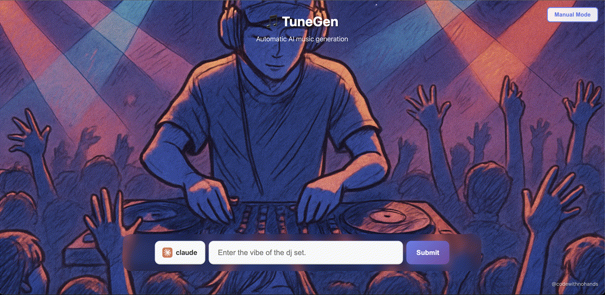
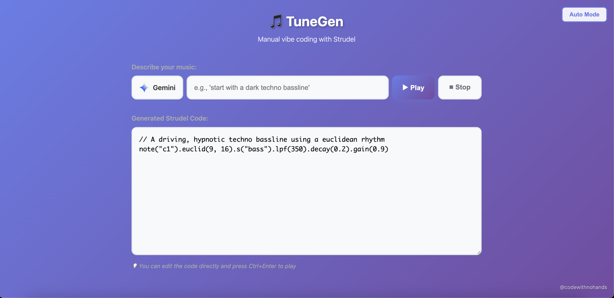

## TuneGen
`https://github.com/giteliot/tunegen`

**Strudel** is a live-coding environment for algorithmic music composition that uses a JavaScript-based syntax to generate, transform, and control musical patterns in real time.

At its core, it lets you write music with code.

 

  <iframe width="360" height="640" src="https://www.youtube.com/embed/ZCcpWzhekEY" title="DJ_Dave - TuneGen Short" frameborder="0" allow="accelerometer; autoplay; clipboard-write; encrypted-media; gyroscope; picture-in-picture; web-share" allowfullscreen></iframe>
  
Demo: TuneGen in action (DJ Dave)

 

On the other hand, one of the most adopted use case for LLMs, is writing code! So why not combining the two?! 

 

  

   

- **Automatic mode**: Provide a mood or genre and get an endlessly evolving mix. The system refreshes every ~10 seconds to introduce variation. Mind the model costs for long sessions.

 

  
   

- **Manual mode**: Iterate interactively. Nudge the groove with short prompts or edit the generated Strudel code directly for fine-grained control.

 

  
  
  
Screenshots from the app

   

### How It Works
1. The browser hosts a Strudel-based live coding environment and audio engine, with a small sample pack and helpful utilities.
2 The backend queries an LLM provider via OpenRouter and returns Strudel code to run in the browser.
3. In Auto mode, the loop periodically re-prompts to evolve patterns; in Manual mode, you guide changes incrementally.

### Technical Notes
- **Web**: A Simple Python/Flask app and vanilla es6.
- **LLM Integration**: Uses OpenRouter with multiple providers (e.g., GPT, Claude, Gemini, Grok) selectable in the UI.
- **Docs-to-Prompt Pipeline**: Utilities to ingest Strudel MDX docs and consolidate them into an LLM-friendly reference to improve pattern generation.

Here is the end results on the 4 currently main LLMs (GPT-5, Grok4, Gemini 2.5 Pro, Claude Opus 4.1) with a common vibe prompt.

 

  <iframe width="560" height="315" src="https://www.youtube.com/embed/t8Rxbdrd_Cg" title="TuneGen LLM Music Generation Demo" frameborder="0" allow="accelerometer; autoplay; clipboard-write; encrypted-media; gyroscope; picture-in-picture; web-share" allowfullscreen></iframe>
  
Demo: TuneGen LLM Music Generation (YouTube)

 
