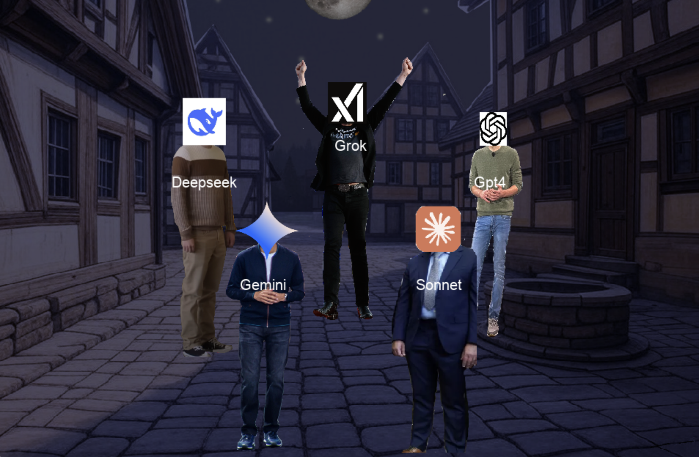

## Werewolf LLM
https://github.com/giteliot/werewolf_llm

A fascinating experiment in AI social interaction and game theory.  
I've always been intrigued by how Large Language Models (LLMs) interact with each other and how they handle social dynamics. The classic party game Werewolf (also known as Mafia) seemed like the perfect setting to explore this: it combines deception, social deduction, and strategic thinking in a way that really tests an AI's ability to maintain context and make decisions based on incomplete information.

The project is a text-based implementation of Werewolf where different LLM models take on roles like Werewolf, Villager, Seer, and Doctor. Each AI player has its own personality and strategy, making each game unique and unpredictable. The game follows the traditional rules: werewolves try to eliminate townsfolk at night while remaining hidden, while the townsfolk try to identify and eliminate the werewolves during the day through discussion and voting.

### How It Works
 

    <iframe width="560" height="315" src="https://www.youtube.com/embed/c67rxJbPyXc" frameborder="0" allow="accelerometer; autoplay; clipboard-write; encrypted-media; gyroscope; picture-in-picture" allowfullscreen></iframe>

 

The game is structured around a day-night cycle:

1. During the night phase:
   - Werewolves choose a victim
   - The Seer can reveal one player's role
   - The Doctor can save one player from death

2. During the day phase:
   - Players discuss and try to identify the werewolves
   - Everyone votes to eliminate a suspect
   - The game continues until either all werewolves or all townsfolk are eliminated

Each AI player maintains its own memory of the game events and uses this information to make decisions. The LLMs are prompted with their role-specific instructions and the game's current state, allowing them to engage in natural conversation and strategic decision-making.

### Technical Implementation
The project is built in Python and uses:
- OpenRouter API for accessing different LLM models
- A custom visualization system for game replays

The game state is managed through a series of phases, with each phase having specific actions and interactions. The system is designed to be extensible, allowing for new roles and mechanics to be added easily.

### Visualization System

    

One of the most engaging aspects of the project is its visualization system, built using **Pygame**. The system uses the log file created in the text based simulation of the game, and renders it graphically, using pygame and some basic sprites, also playing the voices using **openlab**. 